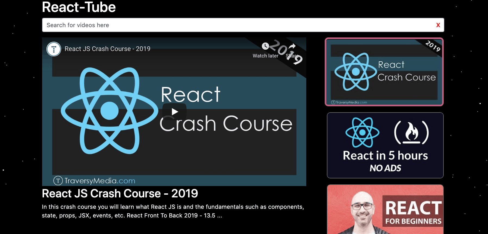

# React-Tube: A Custom REACT YouTube Player

- - -

## Overview

This fully functional single-page application uses the [Reactjs](https://reactjs.org/) framework and the YouTube API to provide a custom and mobile responsive UI for viewing, playing, and searching YouTube.

In addition to React, the app also uses several companion libaries for added options and functionality such as:

* [styled-components](https://www.npmjs.com/package/styled-components) - for easier React Module styling throught use of template literals contained within back ticks ``.
* [reactstrap](https://www.npmjs.com/package/reactstrap) - for a React version of the popular and powerful Bootstrap library.
* [axios](https://www.npmjs.com/package/axios) - for the Google/YouTube API calls
* [Parallax Star Backgroun](https://codepen.io/saransh/pen/BKJun) - pure CSS background animation for a little extra flair.

### Instructions

1. YouTube API key - Anyone wishing to use this project for their own purposes will need to obtain their own YouTube API key from the Google developer console here: https://console.developers.google.com/apis/library/youtube.googleapis.com?q=youtube&id=125bab65-cfb6-4f25-9826-4dcc309bc508&project=bookscan-44301

2. Create an .env file - To keep your API key privite, in the project root directory create a new text file simply titled .env and add to it the following:

        REACT_APP_YOUTUBE_API_KEY=YOUR-API-KEY-HERE

Where you simply replace the "YOUR-API-KEY-HERE" with your actual API key value.

3. NPM Install - if you haven't already, you will need to set your terminal or bash window to the project directory and install all required components prior to running. To do this within your terminal simply type:

        npm install

4. NPM Start - to demo or test the project locally simply use 'npm start' in the terminal to spin up locally (see notes below for more details).

- - -

* Serve is used to run the production build of the solution
        npm run build
        npx serve build

This project was bootstrapped with [Create React App](https://github.com/facebook/create-react-app).

## Available Scripts

In the project directory, you can run:

### `npm start`

Runs the app in the development mode. 
Open [http://localhost:3000](http://localhost:3000) to view it in the browser.

The page will reload if you make edits. 
You will also see any lint errors in the console.

### `npm test`

Launches the test runner in the interactive watch mode. 
See the section about [running tests](https://facebook.github.io/create-react-app/docs/running-tests) for more information.

### `npm run build`

Builds the app for production to the `build` folder. 
It correctly bundles React in production mode and optimizes the build for the best performance.

The build is minified and the filenames include the hashes. 
Your app is ready to be deployed!

See the section about [deployment](https://facebook.github.io/create-react-app/docs/deployment) for more information.

### `npm run eject`

**Note: this is a one-way operation. Once you `eject`, you can’t go back!**

If you aren’t satisfied with the build tool and configuration choices, you can `eject` at any time. This command will remove the single build dependency from your project.

Instead, it will copy all the configuration files and the transitive dependencies (Webpack, Babel, ESLint, etc) right into your project so you have full control over them. All of the commands except `eject` will still work, but they will point to the copied scripts so you can tweak them. At this point you’re on your own.

You don’t have to ever use `eject`. The curated feature set is suitable for small and middle deployments, and you shouldn’t feel obligated to use this feature. However we understand that this tool wouldn’t be useful if you couldn’t customize it when you are ready for it.

## Learn More

You can learn more in the [Create React App documentation](https://facebook.github.io/create-react-app/docs/getting-started).

To learn React, check out the [React documentation](https://reactjs.org/).

### Code Splitting

This section has moved here: https://facebook.github.io/create-react-app/docs/code-splitting

### Analyzing the Bundle Size

This section has moved here: https://facebook.github.io/create-react-app/docs/analyzing-the-bundle-size

### Making a Progressive Web App

This section has moved here: https://facebook.github.io/create-react-app/docs/making-a-progressive-web-app

### Advanced Configuration

This section has moved here: https://facebook.github.io/create-react-app/docs/advanced-configuration

### Deployment

This section has moved here: https://facebook.github.io/create-react-app/docs/deployment

### `npm run build` fails to minify

This section has moved here: https://facebook.github.io/create-react-app/docs/troubleshooting#npm-run-build-fails-to-minify
